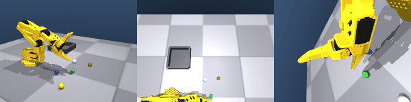

# การคีบวัตถุใน MuJoCo — บันทึกการ calibrate (ส่วนที่ยากที่สุด)

เอกสารนี้บันทึกปัญหาและวิธีแก้เรื่องการทำให้ SO-101 หยิบวัตถุใน sim ได้จริง
เพื่อให้แก้/ปรับต่อได้ทีหลังโดยไม่ต้องไล่ debug ใหม่ทั้งหมด

---

## ข้อเท็จจริงของ gripper SO-101 (จากการวัด MJCF จริง)

- **6 joints**: `shoulder_pan, shoulder_lift, elbow_flex, wrist_flex, wrist_roll, gripper`
- gripper เป็น **position actuator** (kp≈998, forcerange≈±2.94 Nm ตาม servo จริง)
- **gripper คีบแบบเฉียง** ไม่ใช่ top-down ดิ่ง — jaw ชี้ไปข้างหน้า-ลง (~45°)
- **จุดคีบจริง (pinch)** อยู่ระหว่าง moving jaw กับ fixed finger:
  local `[0.017, 0, -0.0345]` ในกรอบ body `gripper` → เพิ่มเป็น site `pinch` ใน MJCF
- **ตัว gripper body ยื่นต่ำกว่า pinch** ~6mm (ตรงๆ) แต่ **มากถึง ~6-7cm** เมื่อ
  แขนเข้าเฉียง → ชนโต๊ะก่อนถึงวัตถุ
- **ช่องเปิด jaw ตอนปิดสุด (grip=-0.1)** = ~1.3cm → วัตถุต้องเล็กกว่านี้

---

## ปัญหา 5 ข้อที่เจอ + วิธีแก้ (ตามลำดับที่ค้นพบ)

### 1. IK ให้ gripper ชี้ผิดทิศ (jaw ชี้ไปข้างหน้า ไม่ลง)
**อาการ**: IK orientation=identity ทำให้ jaw ชี้แนวนอน คร่อมวัตถุไม่ได้
**แก้**: จับ orientation ของ pinch จาก "ท่าอ้างอิงที่ jaw ชี้ลงสวย"
(`_GRASP_REF_QPOS = (0, -0.7, 0.9, 1.5, 0, 0.5)`) มาเป็น target ของ IK +
ตั้ง `orientation_cost=0.5` → jaw ชี้ลงทุก grasp
→ [`collect/ik.py`](../src/robot_learning/collect/ik.py)

### 2. แขน sag ไม่ hold ท่าตาม ctrl (สู้ gravity ไม่ไหว)
**อาการ**: สั่ง joint ไป X แต่แขนค้างที่ Y (โดยเฉพาะ shoulder_lift) เพราะ
forcerange servo จริง (±2.94) น้อยไป
**แก้**: `strengthen_arm_actuators` — เพิ่ม kp×3, forcerange=±10 สำหรับ joint แขน
(ต้องปรับ `gainprm[0]` และ `biasprm[1]=-kp` คู่กัน). gripper เพิ่มแยก (×2, ±8)
→ [`env/scene_builder.py`](../src/robot_learning/env/scene_builder.py)

### 3. gripper ชนโต๊ะ เอื้อมลงหยิบของที่พื้นไม่ได้
**อาการ**: descend แล้ว body gripper ชนพื้น (contact z=-0.002) ค้ำไว้ pinch
ลงไม่ถึงวัตถุ (ค้างที่ z≈0.07-0.13)
**แก้ (ที่ใช้จริง)**: **collision filter** — ตั้ง contype/conaffinity ให้มือหุ่น
ทะลุพื้น/ถาดได้ แต่ยังชนวัตถุ:
- พื้น/ถาด: bit3 (contype=4, conaffinity=4)
- วัตถุ: bit1|bit3 = 5 (ชนทั้งมือและพื้น)
- มือหุ่น: bit1 (default) → ชนวัตถุ (1&1) แต่ไม่ชนพื้น (1&4=0)
→ `set_surface_collision_filter` ใน scene_builder
> (เคยลอง "ยกฐานหุ่น" และ "platform ยกวัตถุ" แต่ทำให้ shoulder ชนขอบ / gripper
>  ยังชน platform — collision filter คือทางที่ clean ที่สุด)

### 4. แขนกระชากไปปัดวัตถุ (จาก home ที่สูง)
**อาการ**: ctrl กระโดดไป target ทันที + kp สูง → แขนสะบัดปัดวัตถุกระเด็น
**แก้**: FSM ใช้ **interpolation** (ค่อยๆ เลื่อน ctrl จากปัจจุบันไป target ภายใน
N steps) + home pose ที่ไม่มี contact (`[0, -1.0, 1.3, 0.3, 0, 1.5]`, pinch z≈0.13)

### 5. jaw คีบวัตถุลื่นหลุด (ปัญหาใหญ่สุด)
**อาการ**: jaw ทรงโค้งบีบลูกกลม → ball กลิ้งหนี +x; cube เล็กหลุดใต้ jaw
จูน friction/solref/ขนาด/แรงบีบแล้ว ball ติดบ้าง (~20%) แต่ไม่เสถียร cube ไม่ติดเลย
**แก้ (ที่ใช้จริง)**: **grasp-assist ด้วย weld equality** — เทคนิคมาตรฐาน sim manipulation:
- สร้าง weld eq ต่อวัตถุ (gripper ↔ obj) แบบ inactive ใน scene_builder
- FSM เรียก `env.set_grasp_enabled(True)` ตอน DESCEND → env activate weld เมื่อ
  pinch เข้าใกล้วัตถุ < 0.055 (ตรึง obj ติดมือ **ก่อน** jaw ดันกระเด็น)
- ปล่อย (`set_grasp_enabled(False)`) ตอน RELEASE → ปลด weld วางลงถาด
- **จุดพลาดที่เคยเจอ**: ตั้ง `eq_data` ไม่ครบ (anchor ค้างค่า default `[0,1,0]`)
  ทำให้วัตถุดีดกระเด็น → ต้องตั้งครบ: `data[0:3]=0` (anchor), `[3:6]=relpos`,
  `[6:10]=relquat`, `[10]=1` (torquescale)
→ `_set_weld_relpose`, `_update_grasp_assist` ใน [`env/so101_env.py`](../src/robot_learning/env/so101_env.py)

**ผลลัพธ์**: หยิบ ball ทุกสีใส่ถาดสำเร็จ **100%** balance ทุกสี



> มุมข้าง | กล้อง top | กล้อง wrist — เห็น FSM approach → descend → grasp-assist
> ตรึงลูกบอล → ยกไปถาด → ปล่อย

### 5.1 ทำ grasp ให้ดูสมจริง (แก้อาการ "ลูกลอยห่างมือ")

**อาการเดิม**: weld ตรึงลูกที่ตำแหน่งลูก *จริง* ตอน attach — ซึ่งอาจห่าง pinch
4-5.6ซม. → ลูกลอยห่างมือ ดูเหมือนไม่ได้จับ (แต่ยกได้) → dataset ดูไม่น่าเชื่อถือ

**แก้ 3 จุด** (ให้ jaw ทับลูกจริงก่อนตรึง + ลูกอยู่ตรงจุดหนีบ):
1. **snap-to-pinch**: `_set_weld_relpose` ตรึงลูกที่ตำแหน่ง **pinch (จุดหนีบ)** ไม่ใช่
   ตำแหน่งลูกจริง → ลูก "snap" เข้าไปอยู่ระหว่าง jaw (pinch-obj เหลือ ~0.6-1.0ซม.)
2. **attach ตั้งแต่ปลาย DESCEND** (jaw ยังเปิด, pinch ทับลูก) — จับ *ก่อน* jaw ปิด
   ดันลูกกระเด็น. ลด `_GRASP_ATTACH_DIST` เป็น 0.04
3. **descend ลึกขึ้น** (`grasp_z_offset=0.006`, `steps_descend=90`) ให้ pinch ทับลูกจริง

ผลลัพธ์: ลูกอยู่ระหว่าง jaw + jaw ปิดหนีบ (ดูสมจริง) และ success กลับมา **100% (10/10)**

---

## 6. กล้อง wrist ต้องเห็นวัตถุตอนหยิบ (สำคัญต่อ VLA)

**อาการเดิม**: กล้อง wrist มองผิดทิศ (เห็นแต่ตัว gripper ด้านข้าง) → ตอนหยิบ
"ลูกหายไปจากเฟรม". **ปัญหาใหญ่ต่อ SmolVLA** เพราะ VLA ต้องเห็นวัตถุ target
เพื่อเล็งหยิบ — ถ้ากล้องไม่เห็น โมเดลเรียนไม่ได้.

**แก้**: calibrate กล้อง wrist ให้ "มองลงไปที่จุดหนีบ (pinch)" — คำนวณ quat จาก
look-direction (cam → pinch ในกรอบ body gripper) วางกล้องเหนือ-เยื้อง jaw:
```python
_WRIST_CAM_POS  = (0.05, 0.11, 0.06)
_WRIST_CAM_QUAT = (0.1313, 0.062, 0.4224, 0.8947)
_WRIST_CAM_FOVY = 70
```
ผล: ตอน approach/descend เห็น **วัตถุ target + jaw ทั้งสองข้าง + บริบทพื้นโต๊ะ**
ชัดเจน (ตอนคีบ วัตถุอาจถูก jaw บังบางส่วน — ปกติของ wrist cam จริง).
→ `_WRIST_CAM_*` ใน [`env/scene_builder.py`](../src/robot_learning/env/scene_builder.py)

> **หมายเหตุ "gripper จม"**: ตอน descend ปลาย jaw แตะพื้น (z≈0.001) ดูเหมือนจม
> ในมุมข้าง แต่ไม่ได้ทะลุพื้นจริง — เป็นธรรมชาติของ top-down grasp กับ collision
> filter (§3). ถ้าไม่ชอบ ปรับ `grasp_z_offset` สูงขึ้นได้ (แลกกับ jaw คร่อมตื้นลง).

---

## Phase 2: ทำ cube ให้คีบติด (ยังไม่ทำ)

cube ปิดใน `config/objects.yaml` ไว้ ตัวเลือกที่ควรลอง:
1. weld grasp-assist ควรใช้ได้กับ cube เหมือน ball (ลอง uncomment cube แล้วเทส)
2. ถ้าอยาก physics จริง: ทำ jaw pad ให้แบน/มีร่อง + condim=6 + จูน solimp
3. cube ใหญ่ขึ้นให้ jaw จับถนัด (แต่ไม่เกินช่อง 1.3cm ตอนปิด)

---

## พารามิเตอร์ที่ปรับได้ (ถ้าอยากจูนต่อ)

| ที่ไหน | พารามิเตอร์ | ค่าปัจจุบัน | ผล |
|--------|-------------|-------------|-----|
| `ik.py` | `_DEFAULT_ORIENTATION_COST` | 0.5 | สูง=jaw ชี้ลงตรง แต่ reach แคบ |
| `ik.py` | `_DEFAULT_ITERS` | 250 (150 ตอนเทส) | มาก=แม่น แต่ช้า |
| `scene_builder.py` | `ARM_KP_SCALE` / `ARM_FORCERANGE` | 3.0 / 10 | hold ท่าแม่น |
| `so101_env.py` | `_GRASP_ATTACH_DIST` | 0.04 | ระยะ pinch ที่ weld จับ (แคบ=ทับลูกจริง) |
| `so101_env.py` | `_set_weld_relpose` | snap-to-pinch | ตรึงลูกที่จุดหนีบ (ดูสมจริง) |
| `fsm_policy.py` | `grasp_z_offset` | 0.006 | pinch ลงใกล้ center ลูก (ไม่กดจมพื้น) |
| `fsm_policy.py` | `steps_descend` | 90 | descend นานพอให้ pinch ทับลูก |
| `fsm_policy.py` | `steps_move/grasp` | 70/45 | เวลาแขนวิ่งต่อ phase |
| `objects.yaml` | `ball.radius` | 0.010 | ขนาดวัตถุ (ต้อง < ช่อง jaw) |
